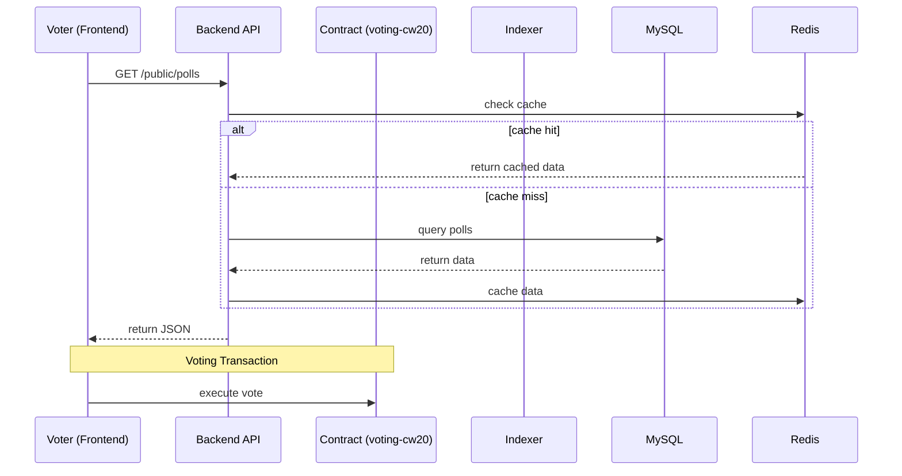

# System Architecture

Dokumen ini menjelaskan arsitektur sistem **Voting DApp** yang terdiri dari Frontend (Vue), Backend (Axum/Rust), Smart Contract (CosmWasm), serta komponen Off-chain (Indexer/Notifier) dengan **MySQL** sebagai database utama dan Redis untuk cache.

    +-----------------------+
    |      Frontend Vue     |
    | (UI publik + admin)    |
    +-----------+-----------+
                |
                | REST API (polls, vote result, admin operations)
                v
    +-----------------------+
    |   Backend Axum        |
    | MySQL + Redis + JWT   |
    +-----------+-----------+
                |
                | Admin push poll → on-chain message
                v
    +-----------------------+
    | CosmWasm Contract     |
    | (voting-cw20)         |
    +-----------+-----------+
                |
                | Emits Vote events
                v
    +-----------------------+
    | Off-chain Indexer     |
    | reads Vote events,     |
    | writes to MySQL       |
    +-----------+-----------+
                |
                | Cached & fast queries
                v
    +-----------------------+
    | MySQL Database        |
    +-----------------------+

## High-level Diagram (Mermaid)

## Komponen

| Komponen            | Fungsi                                                                 |
|---------------------|------------------------------------------------------------------------|
| **Frontend Vue**     | UI untuk publik dan admin: tampil poll, vote, login admin, push on-chain |
| **Backend Axum**     | REST endpoints, otentikasi, simpan metadata poll di MySQL, caching via Redis |
| **CosmWasm Contract**| Logika voting: menerima vote, validasi, menyimpan ke state blockchain     |
| **Off-chain Indexer** | Mendengarkan event dari contract → simpan hasil vote ke MySQL untuk performa |
| **MySQL**            | Menyimpan semua data: polls, hasil voting, metadata, cache               |
| **Redis**            | Cache sementara untuk mempercepat read (mis. hasil polling)             |

---

## Alur Data & Interaksi

1. **Admin membuat poll** di frontend → dikirim ke backend → disimpan ke tabel `polls` di MySQL (status: draft).  
2. **Admin push on-chain** → backend memanggil fungsi ke contract via gRPC/execute → contract di-deploy/instantiate.  
3. **Voter vote** via frontend + wallet (native atau CW20) → TX ke contract.  
4. Contract emit event `Vote` → off-chain indexer tangkap event → tulis ke tabel `votes_idx` di MySQL.  
5. Backend membaca cached hasil dari MySQL + Redis → frontend publik dapat tampil cepat hasil polling.  

---

## Keuntungan Arsitektur Ini

- MySQL sebagai **single source of truth** untuk data polling & hasil → memudahkan query / storage  
- Off-chain indexer** mempercepat dan mengurangi dependensi frontend langsung ke smart contract untuk hasil  
- Redis untuk cache → mengurangi latensi baca di frontend  
- Arsitetur modular: bisa deploy backend atau indexer terpisah, ubah chain RPC, dsb.

