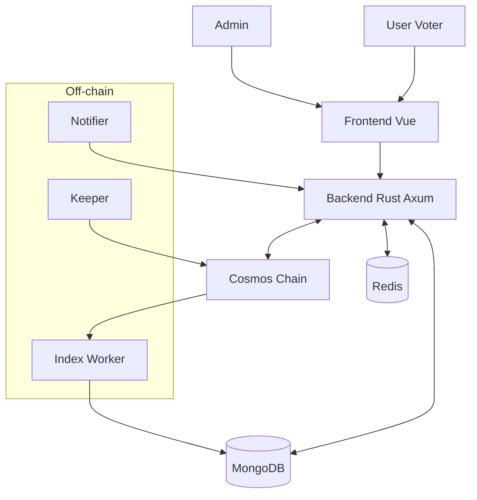

# System Architecture

- **Frontend**: Vue SPA, connect Keplr wallet.
- **Backend**: Axum API, persist data in Mongo, cache in Redis.
- **On-chain**: CosmWasm voting contract.
- **Off-chain**: 
  - Indexer tail event `Vote`.
  - Notifier kirim reminder.
  - Keeper eksekusi ClosePoll.
